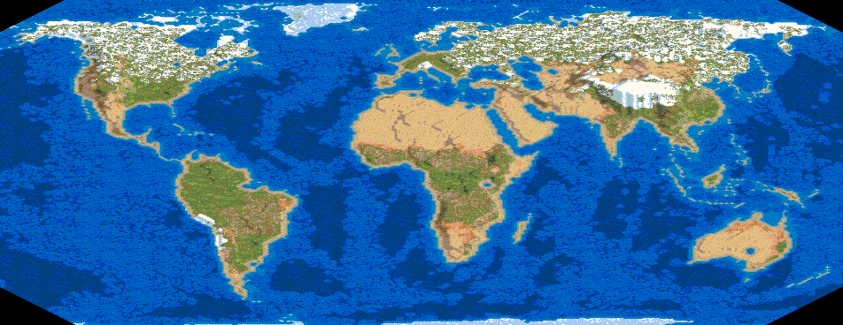

# Age of Empires II Real Map Creator

This is an [online tool to create Age of Empires scenarios based on real-world geography](https://peterolson.github.io/AOE2-Real-Map-Creator/).

## How to use it

### Moving the map around

Click and drag the map to pan, and use the mouse wheel to scroll in and out.

### Map projections

There are many different ways of representing a sphere on a two-dimensional surface, each with its own advantages and disadvantages. Here are the map projections currently supported by this tool:

 - [Equirectangular projection](https://en.wikipedia.org/wiki/Equirectangular_projection)
 - [Mercator projection](https://en.wikipedia.org/wiki/Mercator_projection)
 - [Cylindrical equal-area projection](https://en.wikipedia.org/wiki/Cylindrical_equal-area_projection)
 - [Eckert IV projection](https://en.wikipedia.org/wiki/Eckert_IV_projection)
 - [Orthographic projection](https://en.wikipedia.org/wiki/Orthographic_projection_in_cartography)
 - [Stereographic projection](https://en.wikipedia.org/wiki/Stereographic_projection)
 
### Map size

You can create any maps of any size from 120x120 (Tiny, best with 2 players) to 255x255 (Giant, best with 8 players).

(Developer notes: Maps smaller than 120x120 work on the original game, but cause an AI error in HD. I haven't yet figured out how to generate maps between Giant and LudiKRIS (512x512).)

### Stretch

The stretch slider stretches and shrinks the map horizontally. 

By default, Equirectangular, Mercator, Cylindrical, and Eckert IV projections are shrunk to fit the whole world inside the square. Stretching these projections by a factor of 2.00 will make the proportions more natural.

### Rotate

The rotate slider rotates the map. A positive rotation moves counter-clockwise, and a negative rotation moves clockwise.

In Age of Empires maps are displayed as a diamond, so you will need to rotate -45° to make north face upward in-game.

### Elevation

The elevation slider determines the maximum elevation grade that can be present in the map. A lower number will result in a flatter map, and a higher number will result in a more hilly map.

The Age of Empires map editor only has elevations 0-6, but by programmatically changing the scenario data it is possible to go up to elevation 255. Using higher elevations sometimes causes issues in-game when painting the map on the screen.

### Data set

You can choose to save the map using one of the following formats:

 - Original (`.scx`) - Creates an Age of Kings + Conquerors expansion map. These maps can also be played in the HD version.
 - HD Expansions (`.aoe2scenario`) - Creates a map with the HD expansions (Forgotten Empires, African Kingdoms, and Rise of Rajas). This allows for more terrain options. These maps can only be opened in the HD version.
 
### Terrains
 
The world map is divided into different climate types using the [Köppen–Geiger climate classification system](https://en.wikipedia.org/wiki/K%C3%B6ppen_climate_classification). You can choose which terrains you would like to correspond to the different climate types.
 
At the top there is a list of terrains that can be used. You can mouse over the image to see its description. To add a terrain to a climate type, drag the image to the corresponding box.

If a climate box contains more than one terrain, those terrains will randomly be mixed in the map. For example, if the "Tundra" box has one snow and one ice, then tundra regions will have 50% snow and 50% ice. Similarly, if it has three snows and one ice, then tundra regions will have 75% snow and 25% ice.

## Where do I save the map?

Original game (only `.scx` files)

    C:\Program Files (x86)\Microsoft Games\Age of Empires II\Scenario

HD Version (`.scx` and `aoe2scenario` files)

    C:\Program Files (x86)\Steam\steamapps\common\Age2HD\resources\_common\scenario
	
These paths may vary depending on where you installed Age of Empires or where you installed Steam.

## Contributing

If you find any bugs or have any feature requests, please [post an issue on GitHub](https://github.com/peterolson/AOE2-Real-Map-Creator/issues/new).

If you are a programmer, feel free to add a pull request for any bug fixes or enhancements.